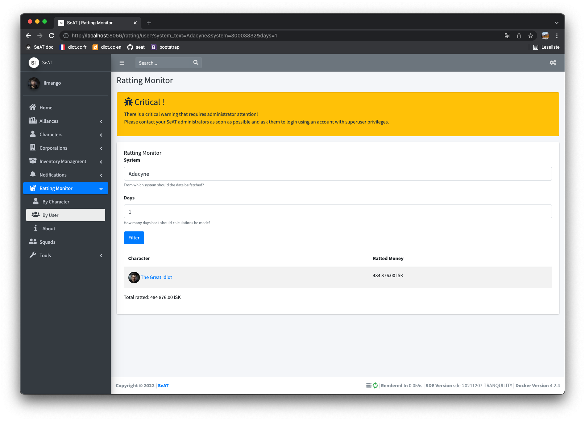

# seat-rat
A small module to monitor ratting usage across systems, e.g. to prevent the bounty risk modifier from dropping too much.

## Installation
See the instruction over at the [seat documentation](https://eveseat.github.io/docs/community_packages/).

The package name is `recursivetree/seat-rat`.